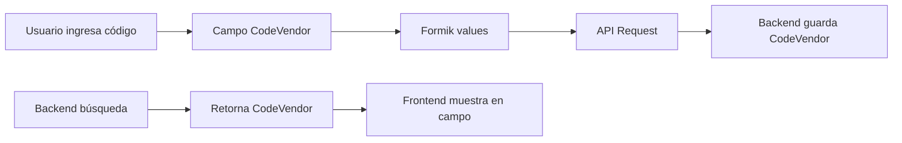

# Actualización: Uso de CodeVendor en Formularios de Cotizaciones

## 📝 Cambios Realizados

### 🎯 **Objetivo**
Actualizar los formularios de crear y editar cotizaciones para usar el campo `CodeVendor` en lugar de `SupplierCode` para el código del proveedor, manteniendo consistencia con el backend.

### 📁 **Archivos Modificados**

#### 1. `src/pages/apps/quotations/create.tsx`
**Antes:**
```tsx
<TextField
  size="small"
  name={`products[${index}].SupplierCode`}
  value={(product as any).SupplierCode || ''}
  onChange={handleChange}
  placeholder="Código proveedor"
  sx={{ minWidth: 120 }}
/>
```

**Después:**
```tsx
<TextField
  size="small"
  name={`products[${index}].CodeVendor`}
  value={product.CodeVendor || ''}
  onChange={handleChange}
  placeholder="Código proveedor"
  sx={{ minWidth: 120 }}
/>
```

#### 2. `src/pages/apps/quotations/edit.tsx`
**Cambio idéntico al formulario de crear cotizaciones**

### 🔧 **Estructura de Datos**

#### Backend (`Quotation.Service.ts`)
El servicio del backend ya retorna `CodeVendor` en la búsqueda predictiva:
```typescript
return rows.map(r => ({
  Id: r.product_id,
  Image: this.buildImageUrl(r.img || ''),
  CodeVendor: r.code_product || '', // ✅ Campo correcto
  Code: r.code || r.code_product || r.public_id || String(r.product_id),
  // ... otros campos
}));
```

#### Frontend (`api/quotations.ts`)
El tipo `QuotationProduct` ya incluye `CodeVendor`:
```typescript
export interface QuotationProduct {
  Id?: number;
  Image: string;
  ImageFile?: File;
  CodeVendor: string; // ✅ Campo disponible
  Code: string;
  Description: string;
  // ... otros campos
}
```

### ✅ **Compatibilidad Verificada**

#### 1. **ProductAddDialog** ✅
- Ya usa `CodeVendor` correctamente
- Maneja tanto búsqueda como entrada manual
- Compatible con los cambios

#### 2. **Tipos TypeScript** ✅
- `QuotationProduct` incluye `CodeVendor`
- No requiere cambios adicionales en tipos

#### 3. **Backend API** ✅
- Servicio retorna `CodeVendor` en búsquedas
- Compatible con la estructura esperada

### 🎨 **Flujo de Datos Actualizado**



### 🧪 **Pruebas Recomendadas**

1. **Crear Cotización:**
   - ✅ Agregar producto manual con código de proveedor
   - ✅ Buscar producto del catálogo (debe mostrar CodeVendor)
   - ✅ Guardar cotización y verificar que se persiste

2. **Editar Cotización:**
   - ✅ Cargar cotización existente (debe mostrar CodeVendor)
   - ✅ Modificar código de proveedor
   - ✅ Guardar cambios

3. **Validación de Datos:**
   - ✅ Verificar que el campo se guarda en la base de datos
   - ✅ Confirmar que se muestra correctamente al recargar

### 📋 **Beneficios del Cambio**

- ✅ **Consistencia**: Mismo campo en frontend y backend
- ✅ **Precisión**: Usa el campo correcto según la base de datos
- ✅ **Mantenibilidad**: Menos confusión entre `SupplierCode` y `CodeVendor`
- ✅ **Integración**: Mejor sincronización con el catálogo de productos

### 🚨 **Notas Importantes**

1. **Migración de Datos**: Si hay cotizaciones existentes con `SupplierCode`, considerar migración
2. **Documentación**: Actualizar documentación de API si es necesario
3. **Testing**: Probar flujos completos de creación y edición

### 🔄 **Campos Relacionados**

| Campo Frontend | Campo Backend | Descripción |
|----------------|---------------|-------------|
| `CodeVendor` | `code_product` | Código del proveedor |
| `Code` | `code` | Código interno/público |
| `Description` | `name/description` | Descripción del producto |

### ✨ **Estado Final**

- ✅ Formularios actualizados
- ✅ Tipos compatibles
- ✅ Backend preparado
- ✅ Compilación exitosa
- ✅ Listo para testing

Los cambios son compatibles hacia atrás y mantienen la funcionalidad existente mientras mejoran la consistencia de datos.